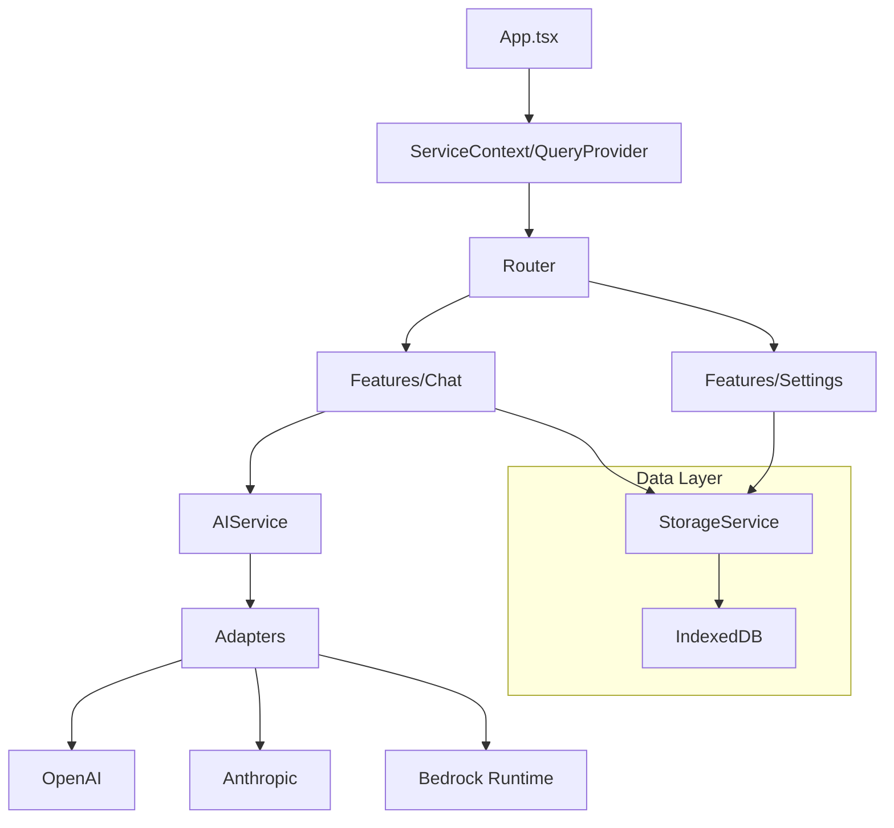

# Phase 3: Architectural Review (Antigravity)

**Audit Date**: December 22, 2025
**Auditor**: CodeBaseGPT-Pro (Antigravity)

---

## 🏗️ Architecture Analysis

### Pattern: Client-Side "Screaming Architecture"
The application uses a **Feature-Sliced Design** (FSD) variant, where features (`chat`, `settings`) are top-level directories in `src/features`, clearly separating them from `shared` UI and core `services`.

**Diagram**:

### Strengths
1.  **Strict Separation**: `ServiceContext` provides Dependency Injection, decoupling React components from business logic.
2.  **Zero Backend**: Architecture is purely client-side (Static SPA), reducing operational costs and complexity (aligned with ARD-002).
3.  **Type Safety**: TypeScript is used extensively with shared `types/` definitions.

### Weaknesses / Risks
1.  **Duplicate Persistence Logic**: `StorageService` uses IndexedDB for config, but `providers.ts` exports legacy `saveConfig` using `localStorage`. This creates a risk of split-brain configuration states.
2.  **Vite Version Anomaly**: `package.json` specifies `bite: "7.3.0"`. As of late 2025, stable Vite is likely v6.x. v7.x suggests a beta or incorrect version, posing a stability risk.
3.  **Dependency Security**: `dexie` (4.x) and `dompurify` (3.x) are up-to-date.

---

## 🛠️ Tech Stack Assessment

| Component | Technology | Status | Recommendation |
|-----------|------------|--------|----------------|
| **Framework** | React 18 | ✅ Current | Upgrade to React 19 (if stable) |
| **Build Tool** | Vite 7.3.0 | ❓ Suspicious | **Downgrade/Verify** to latest Stable (v6) |
| **State** | React Context + Query | ✅ Good | Fit for purpose |
| **Styling** | Tailwind + shadcn/ui | ✅ Excellent | Industry standard |
| **Database** | Dexie (IndexedDB) | ✅ Good | Robust wrapper for IDB |
| **Markdown** | marked + prismjs | ⚠️ Heavy | Consider unified syntax highlighter options |

---

## 🔦 Database Architecture (IndexedDB)

**Schema (v1):**
- `messages`: `id` (PK), `conversationId`, `timestamp`.
- `conversations`: `id` (PK), `createdAt`, `updatedAt`.
- `settings`: `key` (PK), `value`.

**Assessment**:
- Schema is simple and non-relational.
- No migrations logic visible beyond initial version definition.
- **Risk**: Deleting a conversation manually deletes messages (`StorageService.deleteConversation`), but no foreign key constraints enforcement in IndexedDB means potential for orphaned records if not handled carefully in code.

---

## 📋 Recommendations

1.  **Fix Vite Version**: Pin `vite` to a known stable version to avoid potential breaking changes in CI/Build.
2.  **Consolidate Storage**: Deprecate/Remove `saveConfig` and `loadConfig` from `providers.ts`. Use `StorageService` exclusively.
3.  **Schema Hardening**: Add transactional integrity checks for conversation deletion.
